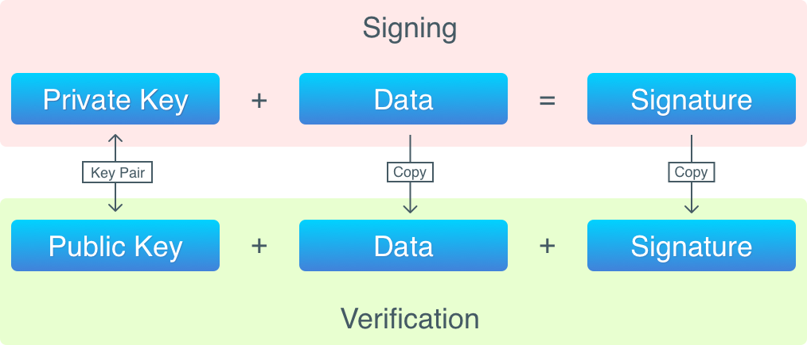
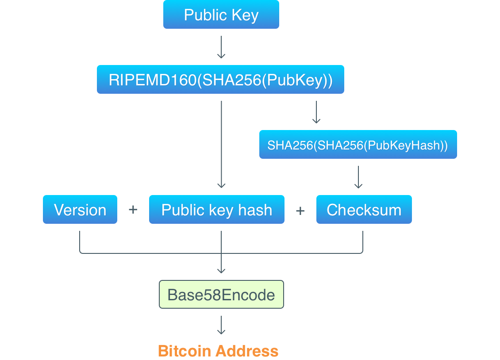

地址
====

## 引言

在上一篇文章中，我们已经初步实现了交易。相信你应该了解了交易中的一些天然属性，这些属性没有丝毫“个人”色彩的存在：在比特币中，没有用户账户，不需要也不会在任何地方存储个人数据（比如姓名，护照号码或者 SSN）。但是，我们总要有某种途径识别出你是交易输出的所有者（也就是说，你拥有在这些输出上锁定的币）。这就是比特币地址（address）需要完成的使命。在上一篇中，我们把一个由用户定义的任意字符串当成是地址，现在我们将要实现一个跟比特币一样的真实地址。

## 比特币地址

这就是一个真实的比特币地址：[1A1zP1eP5QGefi2DMPTfTL5SLmv7DivfNa](https://blockchain.info/address/1A1zP1eP5QGefi2DMPTfTL5SLmv7DivfNa)。这是史上第一个比特币地址，据说属于中本聪。比特币地址是完全公开的，如果你想要给某个人发送币，只需要知道他的地址就可以了。但是，地址（尽管地址也是独一无二的）并不是用来证明你是一个“钱包”所有者的信物。实际上，所谓的地址，只不过是将公钥表示成人类可读的形式而已，因为原生的公钥人类很难阅读。在比特币中，你的身份（identity）就是一对（或者多对）保存在你的电脑（或者你能够获取到的地方）上的公钥（public key）和私钥（private key）。比特币基于一些加密算法的组合来创建这些密钥，并且保证了在这个世界上没有其他人能够取走你的币，除非拿到你的密钥。下面，让我们来讨论一下这些算法到底是什么。

## 公钥加密

公钥加密（public-key cryptography）算法使用的是成对的密钥：公钥和私钥。公钥并不是敏感信息，可以告诉其他人。但是，私钥绝对不能告诉其他人：只有所有者（owner）才能知道私钥，能够识别，鉴定和证明所有者身份的就是私钥。在加密货币的世界中，你的私钥代表的就是你，私钥就是一切。

本质上，比特币钱包也只不过是这样的密钥对而已。当你安装一个钱包应用，或是使用一个比特币客户端来生成一个新地址时，它就会为你生成一对密钥。在比特币中，谁拥有了私钥，谁就可以控制所有发送到这个公钥的币。

私钥和公钥只不过是随机的字节序列，因此它们无法在屏幕上打印，人类也无法通过肉眼去读取。这就是为什么比特币使用了一个转换算法，将公钥转化为一个人类可读的字符串（也就是我们看到的地址）。

>如果你用过比特币钱包应用，很可能它会为你生成一个助记符。这样的助记符可以用来替代私钥，并且可以被用于生成私钥。[BIP-039](https://github.com/bitcoin/bips/blob/master/bip-0039.mediawiki) 已经实现了这个机制。

好了，现在我们已经知道了在比特币中证明用户身份的是私钥。那么，比特币如何检查交易输出（和存储在里面的币）的所有权呢？

## 数字签名

在数学和密码学中，有一个数字签名（digital signature）的概念，算法可以保证：

1. 当数据从发送方传送到接收方时，数据不会被修改；
2. 数据由某一确定的发送方创建；
3. 发送方无法否认发送过数据这一事实。

通过在数据上应用签名算法（也就是对数据进行签名），你就可以得到一个签名，这个签名晚些时候会被验证。生成数字签名需要一个私钥，而验证签名需要一个公钥。签名有点类似于印章，比方说我做了一幅画，完了用印章一盖，就说明了这幅画是我的作品。给数据生成签名，就是给数据盖了章。

为了对数据进行签名，我们需要下面两样东西：

1. 要签名的数据
2. 私钥

应用签名算法可以生成一个签名，并且这个签名会被存储在交易输入中。为了对一个签名进行验证，我们需要以下三样东西：

1. 被签名的数据
2. 签名
3. 公钥

简单来说，验证过程可以被描述为：检查签名是由被签名数据加上私钥得来，并且公钥恰好是由该私钥生成。

>数据签名并不是加密，你无法从一个签名重新构造出数据。这有点像哈希：你在数据上运行一个哈希算法，然后得到一个该数据的唯一表示。签名与哈希的区别在于密钥对：有了密钥对，才有签名验证。但是密钥对也可以被用于加密数据：私钥用于加密，公钥用于解密数据。不过比特币并不使用加密算法。

在比特币中，每一笔交易输入都会由创建交易的人签名。在被放入到一个块之前，必须要对每一笔交易进行验证。除了一些其他步骤，验证意味着：

1. 检查交易输入有权使用来自之前交易的输出
2. 检查交易签名是正确的

如图，对数据进行签名和对签名进行验证的过程大致如下：



现在来回顾一个交易完整的生命周期：

1. 起初，创世块里面包含了一个 coinbase 交易。在 coinbase 交易中，没有输入，所以也就不需要签名。coinbase 交易的输出包含了一个哈希过的公钥（使用的是
 **RIPEMD16(SHA256(PubKey))** 算法）

2. 当一个人发送币时，就会创建一笔交易。这笔交易的输入会引用之前交易的输出。每个输入会存储一个公钥（没有被哈希）和整个交易的一个签名。

3. 比特币网络中接收到交易的其他节点会对该交易进行验证。除了一些其他事情，他们还会检查：在一个输入中，公钥哈希与所引用的输出哈希相匹配（这保证了发送方只能花费属于自己的币）；签名是正确的（这保证了交易是由币的实际拥有者所创建）。

4. 当一个矿工准备挖一个新块时，他会将交易放到块中，然后开始挖矿。

5. 当新块被挖出来以后，网络中的所有其他节点会接收到一条消息，告诉其他人这个块已经被挖出并被加入到区块链。

6. 当一个块被加入到区块链以后，交易就算完成，它的输出就可以在新的交易中被引用。

## 椭圆曲线加密

正如之前提到的，公钥和私钥是随机的字节序列。私钥能够用于证明持币人的身份，需要有一个条件：随机算法必须生成真正随机的字节。因为没有人会想要生成一个私钥，而这个私钥意外地也被别人所有。

比特币使用椭圆曲线来产生私钥。椭圆曲线是一个复杂的数学概念，我们并不打算在这里作太多解释（如果你真的十分好奇，可以查看[这篇文章](http://andrea.corbellini.name/2015/05/17/elliptic-curve-cryptography-a-gentle-introduction/)，注意：有很多数学公式！）我们只要知道这些曲线可以生成非常大的随机数就够了。在比特币中使用的曲线可以随机选取在 0 与 2 ^ 2 ^ 56（大概是 10^77, 而整个可见的宇宙中，原子数在 10^78 到 10^82 之间） 的一个数。有如此高的一个上限，意味着几乎不可能发生有两次生成同一个私钥的事情。

比特币使用的是 ECDSA（Elliptic Curve Digital Signature Algorithm）算法来对交易进行签名，我们也会使用该算法。

## Base58

回到上面提到的比特币地址：1A1zP1eP5QGefi2DMPTfTL5SLmv7DivfNa 。现在，我们已经知道了这是公钥用人类可读的形式表示而已。如果我们对它进行解码，就会看到公钥的本来面目（16 进制表示的字节）：

```
0062E907B15CBF27D5425399EBF6F0FB50EBB88F18C29B7D93
```

比特币使用 Base58 算法将公钥转换成人类可读的形式。这个算法跟著名的 Base64 很类似，区别在于它使用了更短的字母表：为了避免一些利用字母相似性的攻击，从字母表中移除了一些字母。也就是，没有这些符号：0(零)，O(大写的 o)，I(大写的i)，l(小写的 L)，因为这几个字母看着很像。另外，也没有 + 和 / 符号。

下图是从一个公钥获得一个地址的过程：



因此，上面提到的公钥解码后包含三个部分：

```
Version  Public key hash                           Checksum
00       62E907B15CBF27D5425399EBF6F0FB50EBB88F18  C29B7D93
```

由于哈希函数是单向的（也就说无法逆转回去），所以不可能从一个哈希中提取公钥。不过通过执行哈希函数并进行哈希比较，我们可以检查一个公钥是否被用于哈希的生成。

好了，所有细节都已就绪，来写代码吧。很多概念只有当写代码的时候，才能理解地更透彻。

## 实现地址

我们先从钱包 `Wallet` 结构开始：
```python
class Wallet(object):
    # hex version
    VERSION = b'\0'
    def __init__(self, private_key):
        self._private_key = private_key
        self._public_key = private_key.get_verifying_key()
        self._address = ''
    @classmethod
    def generate_wallet(cls, curve=SECP256k1):
        """
        generate a wallet
        """
        sign_key = SigningKey.generate(curve=curve)
        return cls(sign_key)
```
一个钱包只有一个密钥对而已。我们需要 `Wallets` 类型来保存多个钱包的组合，将它们保存到文件中，或者从文件中进行加载。`Wallet` 的构造函数会生成一个新的密钥对。`generate_wallet` 函数非常直观：ECDSA 基于椭圆曲线，所以我们需要一个椭圆曲线。接下来，使用椭圆生成一个私钥。
```python
@property
def address(self):
    if not self._address:
        prv_addr = self.VERSION + self._hash_public_key()
        self._address = base58.b58encode_check(prv_addr)
    return self._address
```
以上是地址的生成，使用base58的库来实现，通过`pip install base58`即可安装，我们也可以直接下载源码放在工程目录下使用。使用该库我们就不用重复造轮子了。
至此，就可以得到一个**真实的比特币地址**，你甚至可以在 [blockchain.info](https://blockchain.info/) 查看它的余额。不过我可以负责任地说，无论生成一个新的地址多少次，检查它的余额都是 0。这就是为什么选择一个合适的公钥加密算法是如此重要：考虑到私钥是随机数，生成同一个数字的概率必须是尽可能地低。理想情况下，必须是低到“永远”不会重复。
另外，注意：你并不需要连接到一个比特币节点来获得一个地址。地址生成算法使用的多种开源算法可以通过很多编程语言和库实现。
注意，现在我们已经不再需要 `script_pub_key` 和 `script_sig` 字段，因为我们不会实现一个脚本语言。相反，`script_sig` 会被分为 `signature` 和 `pub_key` 字段，`script_pub_key` 被重命名为 `PubKeyHash`。我们会实现跟比特币里一样的输出锁定/解锁和输入签名逻辑，不同的是我们会通过方法（method）来实现。

`use_key` 方法检查输入使用了指定密钥来解锁一个输出。注意到输入存储的是原生的公钥（也就是没有被哈希的公钥），但是这个函数要求的是哈希后的公钥。`is_locked_with_key` 检查是否提供的公钥哈希被用于锁定输出。这是一个 `use_key` 的辅助函数，并且它们都被用于 `find_unspent_transactions` 来形成交易之间的联系。

`lock` 只是简单地锁定了一个输出。当我们给某个人发送币时，我们只知道他的地址，因为这个函数使用一个地址作为唯一的参数。然后，地址会被解码，从中提取出公钥哈希并保存在 `pub_key_hash` 字段。


## 实现签名

交易必须被签名，因为这是比特币里面保证发送方不会花费属于其他人的币的唯一方式。如果一个签名是无效的，那么这笔交易就会被认为是无效的，因此，这笔交易也就无法被加到区块链中。

我们现在离实现交易签名还差一件事情：用于签名的数据。一笔交易的哪些部分需要签名？又或者说，要对完整的交易进行签名？选择签名的数据相当重要。因为用于签名的这个数据，必须要包含能够唯一识别数据的信息。比如，如果仅仅对输出值进行签名并没有什么意义，因为签名不会考虑发送方和接收方。

考虑到交易解锁的是之前的输出，然后重新分配里面的价值，并锁定新的输出，那么必须要签名以下数据：

1. 存储在已解锁输出的公钥哈希。它识别了一笔交易的“发送方”。

2. 存储在新的锁定输出里面的公钥哈希。它识别了一笔交易的“接收方”。

3. 新的输出值。

>在比特币中，锁定/解锁逻辑被存储在脚本中，它们被分别存储在输入和输出的 `script_sig` 和 `script_pub_key` 字段。由于比特币允许这样不同类型的脚本，它对 `script_pub_key` 的整个内容进行了签名。

可以看到，我们不需要对存储在输入里面的公钥签名。因此，在比特币里， 所签名的并不是一个交易，而是一个去除部分内容的输入副本，输入里面存储了被引用输出的 `script_pub_key` 。

>获取修剪后的交易副本的详细过程在[这里](https://en.bitcoin.it/wiki/File:Bitcoin_OpCheckSig_InDetail.png). 虽然它可能已经过时了，但是我并没有找到另一个更可靠的来源。

看着有点复杂，来开始写代码吧。先从 `sign` 方法开始：
```python
def sign(self, priv_key, prev_txs):
        if self.is_coinbase():
            return
        tx_copy = self._trimmed_copy()

        for in_id, vin in enumerate(tx_copy.vins):
            prev_tx = prev_txs.get(vin.txid, None)
            if not prev_tx:
                raise ValueError('Previous transaction is error')
            tx_copy.vins[in_id].signature = None
            tx_copy.vins[in_id].pub_key = prev_tx.vouts[vin.vout].pub_key_hash
            tx_copy.set_id()
            tx_copy.vins[in_id].pub_key = None

            sk = ecdsa.SigningKey.from_string(
                binascii.a2b_hex(priv_key), curve=ecdsa.SECP256k1)
            sign = sk.sign(tx_copy.txid.encode())
            self.vins[in_id].signature = binascii.hexlify(sign).decode()
```
coinbase没有输入所以不需要签名。
```python
tx_copy = self._trimmed_copy()
```
将会被签署的是修剪后的交易副本，而不是一个完整交易：
```python
    def _trimmed_copy(self):
        inputs = []
        outputs = []

        for vin in self.vins:
            inputs.append(TXInput(vin.txid, vin.vout, None))

        for vout in self.vouts:
            outputs.append(TXOutput(vout.value, vout.pub_key_hash))
        tx = Transaction(inputs, outputs)
        tx.txid = self.txid
        return tx
```
接下来，我们会迭代副本中每一个输入：

```python
for in_id, vin in enumerate(tx_copy.vins):
    prev_tx = prev_txs.get(vin.txid, None)
    if not prev_tx:
        raise ValueError('Previous transaction is error')
    tx_copy.vins[in_id].signature = None
    tx_copy.vins[in_id].pub_key = prev_tx.vouts[vin.vout].pub_key_hash
```

在每个输入中，`signature` 被设置为 `None` (仅仅是一个双重检验)，`pub_key` 被设置为所引用输出的 `pub_key_hash`。现在，除了当前交易，其他所有交易都是“空的”，也就是说他们的 `signature` 和 `pub_key` 字段被设置为 `None`。因此，**输入是被分开签名的**，尽管这对于我们的应用并不十分紧要，但是比特币允许交易包含引用了不同地址的输入。

```python
tx_copy.set_id()
tx_copy.vins[in_id].pub_key = None
```

`hash` 方法对交易进行序列化，并使用 SHA-256 算法进行哈希。哈希后的结果就是我们要签名的数据。在获取完哈希，我们应该重置 `pub_key` 字段，以便于它不会影响后面的迭代。

现在，关键点：

```python
sk = ecdsa.SigningKey.from_string(
        binascii.a2b_hex(priv_key), curve=ecdsa.SECP256k1)
sign = sk.sign(tx_copy.txid.encode())
self.vins[in_id].signature = binascii.hexlify(sign).decode()
```

我们通过 `priv_key` 对 `tx_copy.txid` 进行签名。一个 ECDSA 签名就是一对数字，我们对这对数字连接起来，并存储在输入的 `signature` 字段。
验证方法与签名是类似的：
```python
def verify(self, prev_txs):
    tx_copy = self._trimmed_copy()

    for in_id, vin in enumerate(self.vins):
        prev_tx = prev_txs.get(vin.txid, None)
        if not prev_tx:
            raise ValueError('Previous transaction is error')
        tx_copy.vins[in_id].signature = None
        tx_copy.vins[in_id].pub_key = prev_tx.vouts[vin.vout].pub_key_hash
        tx_copy.set_id()
        tx_copy.vins[in_id].pub_key = None

        sign = binascii.unhexlify(self.vins[in_id].signature)
        vk = ecdsa.VerifyingKey.from_string(
            binascii.a2b_hex(vin.pub_key), curve=ecdsa.SECP256k1)
        if not vk.verify(sign, tx_copy.txid.encode()):
            return False
    return True
```
和上面类似，先进行副本的拷贝，然后置空`signature`,并重新计算id,然后再进行校验
```python
sign = binascii.unhexlify(self.vins[in_id].signature)
vk = ecdsa.VerifyingKey.from_string(
    binascii.a2b_hex(vin.pub_key), curve=ecdsa.SECP256k1)
if not vk.verify(sign, tx_copy.txid.encode()):
    return False
```
如果校验失败就直接返回`False`。
在`new_transaction`方法中加入签名:
```python
def new_transaction(self, from_addr, to_addr, amount):

    tx = Transaction(inputs, outputs)
    tx.set_id()
    self.sign_transaction(tx, from_wallet.private_key)
    return tx
```
```python
def mine(self, bc):
    pow = ProofOfWork(self)
    for tx in self._transactions:
        if not bc.verify_transaction(tx):
            raise TransactionVerifyError('transaction verify error')
    try:
        nonce, _ = pow.run()
    except NonceNotFoundError as e:
        print(e)
    self._block_header.nonce = nonce
```
在挖矿方法```mine```加入交易参数校验。
测试:
```bash
$python3 cli.py createwallet
Your new address is 11oHh3J3jx4yjKppGjCXijVxxc6QZU8zr

$python3 cli.py printwallet
Wallet are:
LZTnHqJG4sSHXHY5Yx1gDqXv9LKc1586Pj
# 首先初始化
$python3 main.py
1HaccEKgfrng4Bkg9aqBkNKpqQUpVfk8tY 1wQMgVMac1oR9jDDUUBQncK9N1vuwXpoM
Mining a new block
Found nonce == 45ash_hex == 0467d7a2be1538feb4fa3b8e71f96a770406ca42e36e4190a6f3821266868d26
Block(_block_header=BlockHeader(timestamp='1551159892.7875812', hash_merkle_root='', prev_block_hash='', hash='de46120e80fc192d3c2b4f14cce2f45f92f17323200aefce970eb599122c6af0', nonce=None, height=0))
Block(_block_header=BlockHeader(timestamp='1551159893.1240094', hash_merkle_root='', prev_block_hash='', hash='5107a5e658671a652b3858c86f38753e6bcab2295715ceb97cae3411550b5fb8', nonce=45, height=1))

$python3 cli.py send --from 1HaccEKgfrng4Bkg9aqBkNKpqQUpVfk8tY --to 1wQMgVMac1oR9jDDUUBQncK9N1vuwXpoM --amount 10
Mining a new block
Found nonce == 5ash_hex == 0e9ed9e55ea570beeb7606acc626886fb75aa3830317790aa997f5363cf3e01a
send 10 from 1HaccEKgfrng4Bkg9aqBkNKpqQUpVfk8tY to 1wQMgVMac1oR9jDDUUBQncK9N1vuwXpoM

```
一切正常工作。
参考：
[1] [address](https://github.com/liuchengxu/blockchain-tutorial/blob/master/content/part-5/address.md)
[2] [本节完整实现源码](https://github.com/xiaobing94/pysimpleblockchain/tree/part5)