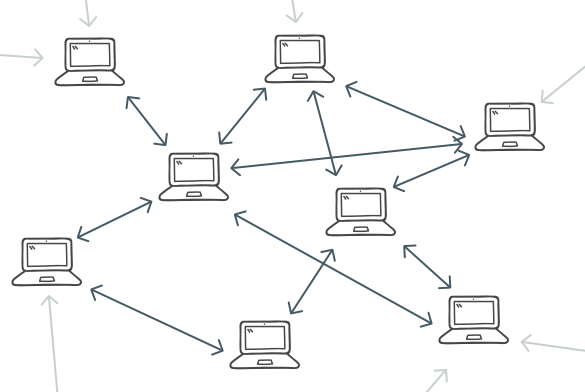

Part 7: 网络
============

## 引言
## 引言

到目前为止，我们所构建的原型已经具备了区块链所有的关键特性：匿名，安全，随机生成的地址；区块链数据存储；工作量证明系统；可靠地存储交易。尽管这些特性都不可或缺，但是仍有不足。能够使得这些特性真正发光发热，使得加密货币成为可能的，是**网络（network）**。如果实现的这样一个区块链仅仅运行在单一节点上，有什么用呢？如果只有一个用户，那么这些基于密码学的特性，又有什么用呢？正是由于网络，才使得整个机制能够运转和发光发热。

你可以将这些区块链特性认为是规则（rule），类似于人类在一起生活，繁衍生息建立的规则，一种社会安排。区块链网络就是一个程序社区，里面的每个程序都遵循同样的规则，正是由于遵循着同一个规则，才使得网络能够长存。类似的，当人们都有着同样的想法，就能够将拳头攥在一起构建一个更好的生活。如果有人遵循着不同的规则，那么他们就将生活在一个分裂的社区（州，公社，等等）中。同样的，如果有区块链节点遵循不同的规则，那么也会形成一个分裂的网络。

**重点在于**：如果没有网络，或者大部分节点都不遵守同样的规则，那么规则就会形同虚设，毫无用处！
## 区块链网络

区块链网络是去中心化的，这意味着没有服务器，客户端也不需要依赖服务器来获取或处理数据。在区块链网络中，有的是节点，每个节点是网络的一个完全（full-fledged）成员。节点就是一切：它既是一个客户端，也是一个服务器。这一点需要牢记于心，因为这与传统的网页应用非常不同。

区块链网络是一个 P2P（Peer-to-Peer，端到端）的网络，即节点直接连接到其他节点。它的拓扑是扁平的，因为在节点的世界中没有层级之分。下面是它的示意图：



[Business vector created by Dooder - Freepik.com](http://www.freepik.com/dooder)

要实现这样一个网络节点更加困难，因为它们必须执行很多操作。每个节点必须与很多其他节点进行交互，它必须请求其他节点的状态，与自己的状态进行比较，当状态过时时进行更新。

## kademlia发现协议
kademlia是p2p的一种节点发现协议，其核心是通过计算节点之间的逻辑距离来发现附近节点以实现节点查找的收敛。
[kademlia详细介绍](
https://github.com/ZtesoftCS/go-ethereum-code-analysis/blob/master/references/Kademlia%E5%8D%8F%E8%AE%AE%E5%8E%9F%E7%90%86%E7%AE%80%E4%BB%8B.pdf)
## 简化协议
这里我们为了说明原理尽可能的简化协议。我们只实现三种请求:
1. 节点握手
2. 获取区块数据
3. 交易广播
为了方便，其中又将节点握手作为心跳发送，并根据心跳信息进行区块同步。

网络协议方面，借鉴以太坊的做法，UDP做协议发现，TCP做数据传输。每当发现一个节点，就通过TCP建立连接，并发送心跳数据，以保证数据的一致性。
## 消息
定义消息类，分别定义了无意义回应和以上三种请求。为了方便处理，这里统一使用字符串而不是二进制数据进行数据传输。
```python
class Msg(object):
    NONE_MSG = 0
    HAND_SHAKE_MSG = 1
    GET_BLOCK_MSG = 2
    TRANSACTION_MSG = 3
    def __init__(self, code, data):
        self.code = code
        self.data = data
```
## TCP服务端
```python
class TCPServer(object):
    def __init__(self, ip='0.0.0.0', port=listen_port):
        self.sock = socket.socket()
        self.ip = ip
        self.port = port
    
    def listen(self):
        self.sock.bind((self.ip, self.port))
        self.sock.listen(5)

    def run(self):
        t = threading.Thread(target=self.listen_loop, args=())
        t.start()

    def handle_loop(self, conn, addr):
        while True:
            recv_data = conn.recv(4096)
            log.info("recv_data:"+str(recv_data))
            try:
                recv_msg = json.loads(recv_data)
            except ValueError as e:
                conn.sendall('{"code": 0, "data": ""}'.encode())
            send_data = self.handle(recv_msg)
            log.info("tcpserver_send:"+send_data)
            conn.sendall(send_data.encode())

    def listen_loop(self):
        while True:
            conn, addr = self.sock.accept()
            t = threading.Thread(target=self.handle_loop, args=(conn, addr))
            t.start()

    def handle(self, msg):
        code = msg.get("code", 0)
        log.info("code:"+str(code))
        if code == Msg.HAND_SHAKE_MSG:
            res_msg = self.handle_handshake(msg)
        elif code == Msg.GET_BLOCK_MSG:
            res_msg = self.handle_get_block(msg)
        elif code == Msg.TRANSACTION_MSG:
            res_msg = self.handle_transaction(msg)
        else:
            return '{"code": 0, "data":""}'
        return json.dumps(res_msg.__dict__)

    def handle_handshake(self, msg):
        block_chain = BlockChain()
        block = block_chain.get_last_block()
        try:
            genesis_block = block_chain[0]
        except IndexError as e:
            genesis_block = None
        data = {
            "last_height": -1,
            "genesis_block": ""
        }
        if genesis_block:
            data = {
                "last_height": block.block_header.height,
                "genesis_block": genesis_block.serialize()
            }
        msg = Msg(Msg.HAND_SHAKE_MSG, data)
        return msg

    def handle_get_block(self, msg):
        height = msg.get("data", 1)
        block_chain = BlockChain()
        block = block_chain.get_block_by_height(height)
        data = block.serialize()
        msg = Msg(Msg.GET_BLOCK_MSG, data)
        return msg

    def handle_transaction(self, msg):
        tx_pool = TxPool()
        txs = msg.get("data", {})
        for tx_data in txs:
            tx = Transaction.deserialize(tx_data)
            tx_pool.add(tx)
        if tx_pool.is_full():
            bc = BlockChain()
            bc.add_block(tx_pool.txs)
            log.info("add block")
            tx_pool.clear()
        msg = Msg(Msg.NONE_MSG, "")
        return msg
```
TCP端比较简单，listen_loop方法监听新的请求并开启一个新线程处理连接中的数据交互。handle_loop方法调用了handle分发处理请求。
handle_handshake处理握手请求，这里将最新块高度和创世块发送出去了，方便和本地数据进行比较，如果远程数据更新，那么就获取新的部分的区块。
handle_get_block获取对应的区块并将数据发送给客户端。
handle_transaction 处理客户端发送来的交易信息。把客户端发送来的交易添加到未确认交易池，如果交易池满了就添加到区块。这里是方便处理才这么做的，实际上，比特币中并不是这样做的，而是由矿工根据情况进行打包区块的。 
## TCP客户端

```python
class TCPClient(object):
    def __init__(self, ip, port):
        self.txs = []
        self.sock = socket.socket()
        log.info("connect ip:"+ip+"\tport:"+str(port))
        self.sock.connect((ip, port))

    def add_tx(self, tx):
        self.txs.append(tx)
    
    def send(self, msg):
        data = json.dumps(msg.__dict__)
        self.sock.sendall(data.encode())
        log.info("send:"+data)
        recv_data = self.sock.recv(4096)
        log.info("client_recv_data:"+str(recv_data))
        try:
            recv_msg = json.loads(recv_data)
        except json.decoder.JSONDecodeError as e:
            return
        self.handle(recv_msg)

    def handle(self, msg):
        code = msg.get("code", 0)
        log.info("recv code:"+str(code))
        if code == Msg.HAND_SHAKE_MSG:
            self.handle_shake(msg)
        elif code == Msg.GET_BLOCK_MSG:
            self.handle_get_block(msg)
        elif code == Msg.TRANSACTION_MSG:
            self.handle_transaction(msg)

    def shake_loop(self):
        while True:
            if self.txs:
                data = [tx.serialize() for tx in self.txs]
                msg = Msg(Msg.TRANSACTION_MSG, data)
                self.send(msg)
                self.txs.clear()
            else:
                log.info("shake")
                block_chain = BlockChain()
                block = block_chain.get_last_block()
                try:
                    genesis_block = block_chain[0]
                except IndexError as e:
                    genesis_block = None
                data = {
                    "last_height": -1,
                    "genesis_block": ""
                }
                if genesis_block:
                    data = {
                        "last_height": block.block_header.height,
                        "genesis_block": genesis_block.serialize()
                    }
                msg = Msg(Msg.HAND_SHAKE_MSG, data)
                self.send(msg)
                time.sleep(5)


    def handle_shake(self, msg):
        data = msg.get("data", "")
        last_height = data.get("last_height", 0)
        block_chain = BlockChain()
        block = block_chain.get_last_block()
        if block:
            local_last_height = block.block_header.height
        else:
            local_last_height = -1
        log.info("local_last_height %d, last_height %d" %(local_last_height, last_height))
        for i in range(local_last_height + 1, last_height+1):
            send_msg = Msg(Msg.GET_BLOCK_MSG, i)
            self.send(send_msg)

    def handle_get_block(self, msg):
        data = msg.get("data", "")
        block = Block.deserialize(data)
        bc = BlockChain()
        try:
            bc.add_block_from_peers(block)
        except ValueError as e:
            log.info(str(e))

    def handle_transaction(self, msg):
        data = msg.get("data", {})
        tx = Transaction.deserialize(data)
        tx_pool = TxPool()
        tx_pool.add(tx)
        if tx_pool.is_full():
            bc.add_block(tx_pool.txs)
            log.info("mined a block")
            tx_pool.clear()

    def close(self):
        self.sock.close()
```
`handle_transaction`处理服务器发送来的交易,将交易添加到交易池，如果交易池满了就添加到区块链中。
`handle_get_block`处理服务器发送来的区块，并将区块更新到链上。
`handle_shake`处理服务器响应的握手信息，如果发现当前的的区块高度低于数据中响应的区块高高度，则发起请求获取新的几个区块。
`shake_loop` 每间隔10秒发送一次握手信息（5秒同步一次区块),如果发现有需要广播的交易则进行交易的广播。
## P2P服务器
p2p节点发现部分，使用了kademlia协议，并使用了kademlia库，安装方法```pip3 install kademlia```
```python
class P2p(object):
    def __init__(self):
        self.server = Server()
        self.loop = None

    def run(self):
        loop = asyncio.get_event_loop()
        self.loop = loop
        loop.run_until_complete(self.server.listen(listen_port))
        self.loop.run_until_complete(self.server.bootstrap([(bootstrap_host, bootstrap_port)]))
        loop.run_forever()
    
    def get_nodes(self):
        nodes = []
        for bucket in self.server.protocol.router.buckets:
            nodes.extend(bucket.get_nodes())
        return nodes
```
其中`run`方法启动节点监听并连接一个初始节点，并运行p2p节点监听。
`get_nodes`方法获取当前所有的节点。
## 连接节点
```python
class PeerServer(Singleton):
    def __init__(self):
        if not hasattr(self, "peers"):
            self.peers = []
        if not hasattr(self, "nodes"):
            self.nodes = []
    
    def nodes_find(self, p2p_server):
        local_ip = socket.gethostbyname(socket.getfqdn(socket.gethostname()))
        while True:
            nodes = p2p_server.get_nodes()
            for node in nodes:
                if node not in self.nodes:
                    ip = node.ip
                    port = node.port
                    if local_ip == ip:
                        continue
                    client = TCPClient(ip, port)
                    t = threading.Thread(target=client.shake_loop, args=())
                    t.start()
                    self.peers.append(client)
                    self.nodes.append(node)
            time.sleep(1)

    def broadcast_tx(self, tx):
        for peer in self.peers:
            peer.add_tx(tx)
            
    def run(self, p2p_server):
        t = threading.Thread(target=self.nodes_find, args=(p2p_server,))
        t.start()
```
`nodes_find`为节点发现方法，每隔1秒进行查找当前是否有新的节点，并开启线程进行连接。
`broadcast_tx`为广播交易的方法，将交易添加到待广播交易池。
## RPC
开启网络监听后，主线程就被p2p网络占用了，我们需要另外的方法进行交互操作。RPC就是常用的方法。我们将命令行操作都通过rpc导出，然后通过rpc调用获取信息。
```python
class Cli(object):
    def get_balance(self, addr):
        bc = BlockChain()
        balance = 0
        utxo = UTXOSet()
        utxo.reindex(bc)
        utxos = utxo.find_utxo(addr)
        print(utxos)
        for fout in utxos:
            balance += fout.txoutput.value
        print('%s balance is %d' %(addr, balance))
        return balance

    def create_wallet(self):
        w = Wallet.generate_wallet()
        ws = Wallets()
        ws[w.address] = w
        ws.save()
        return w.address

    def print_all_wallet(self):
        ws = Wallets()
        wallets = []
        for k, _ in ws.items():
            wallets.append(k)
        return wallets

    def send(self, from_addr, to_addr, amount):
        bc = BlockChain()
        tx = bc.new_transaction(from_addr, to_addr, amount)
        # bc.add_block([tx])
        tx_pool = TxPool()
        tx_pool.add(tx)
        from network import log
        log.info("tx_pool:"+str(id(tx_pool)))
        log.info("txs_len:"+str(len(tx_pool.txs)))
        try:
            server = PeerServer()
            server.broadcast_tx(tx)
            log.info("tx_pool is full:"+str(tx_pool.is_full()))
            log.info("tx_pool d :"+str(tx_pool))
            if tx_pool.is_full():
                bc.add_block(tx_pool.txs)
                log.info("add block")
                tx_pool.clear()
        except Exception as e:
            import traceback
            msg = traceback.format_exc()
            log.info("error_msg:"+msg)
        print('send %d from %s to %s' %(amount, from_addr, to_addr))

    def print_chain(self, height):
        bc = BlockChain()
        return bc[height].block_header.serialize()

    def create_genesis_block(self):
        bc = BlockChain()
        w = Wallet.generate_wallet()
        ws = Wallets()
        ws[w.address] = w
        ws.save()
        tx = bc.coin_base_tx(w.address)
        bc.new_genesis_block(tx)
        return w.address
```
RPC导出：
```python
rpc = RPCServer(export_instance=Cli())
    rpc.start(False)
```
## 测试
分别打开两台主机A和B:
A主机:
```bash
$python3 cli.py start
```
将B主机的conf.py中的bootstrap_host和bootstrap_port修改为A主机的ip和端口。然后启动B主机。
```bash
$python3 cli.py start
```
任意一台主机开启新的窗口执行生成创世块:
```bash
$python3 cli.py genesis_block
Genesis Wallet is: 1LYHea8NjTxaYboXJbR7LemvUZjyQc839r
```
分别在两台机器上查看余额:
```bash
$python3 cli.py balance 1LYHea8NjTxaYboXJbR7LemvUZjyQc839r
1LYHea8NjTxaYboXJbR7LemvUZjyQc839r balance is 1000
```
分别在两台机器上创建地址:
```bash
$python3 cli.py createwallet
Wallet address is 14sQYjj3n2fReJyVNoqHCmCFjNKEZAVcEB
```
查看当前机器的所有地址
```bash
python3 cli.py printwallet
Wallet are:
	19zR4zT9eSFsbSNvnQ1RCrhjN71VzPFTnH
	1MVUrxPuRgtkyLQvAoma4yEarzcMzvQqym
	18kruspe7jAbggR1sUF8fCFsZLn6efSeFk
	14sQYjj3n2fReJyVNoqHCmCFjNKEZAVcEB
```
转账(至少要转两笔才能确认哦，可以修改txpool.py的SIZE属性来调整区块大小)。注意：只有当前有这个地址（即有这个私钥）才能作为from转账给其他地址。
```bash
$python3 cli.py send --from 1LYHea8NjTxaYboXJbR7LemvUZjyQc839r --to 19zR4zT9eSFsbSNvnQ1RCrhjN71VzPFTnH --amount 100
$python3 cli.py send --from 1LYHea8NjTxaYboXJbR7LemvUZjyQc839r --to 19zR4zT9eSFsbSNvnQ1RCrhjN71VzPFTnH --amount 100
```
分别在两台机器上查看余额:
```bash
python3 cli.py balance 1LYHea8NjTxaYboXJbR7LemvUZjyQc839r
1LYHea8NjTxaYboXJbR7LemvUZjyQc839r balance is 1900
```
注意：这里因为重复转了两笔账，使用了同一个UTXO，所以第二笔会失败，由于`1LYHea8NjTxaYboXJbR7LemvUZjyQc839r`为被奖励地址，所以获得了1000得挖矿奖励所以余额为:1000-100+900=1900。

打印区块信息:
```bash
$python3 cli.py print 1
{'timestamp': '1551347915.3271294', 'prev_block_hash': '9f12dad81ab988f247884d7d06de46c6951688dcbedb87df2159669594a44f0d', 'hash': 'a9d02b72690398805fb83efd4680cb710ed4f3c67ea7926fe8faab256c1cad1c', 'hash_merkle_root': 'fe768edf1040c504674e8a468c89f00574a181b88ad2297ef29d307695adb38e', 'height': 1, 'nonce': 3}
```
## 区块同步方式
为了简单，区块采用最简单的方式进行同步。方法如下:
1. 如果发现对方区块高度低于自己，则不做处理。
2. 如果发现对方区块高度高于自己
    (1) 当前最新区块在对应区块能找到，那么就更新最新的区块
    (2) 当前最新区块在对应区块不能找到，那么回滚当前区块，直到回到交叉点，再进行更新区块。
涉及到的源码修改较多，这里就不贴源码了。移步到[本节完整实现源码](https://github.com/xiaobing94/pysimpleblockchain/tree/part7)查看完整源码。
## 问题
1. 为了简单，将握手和广播交易合一了，这导致了广播交易不及时。
2. 新区块没有实时进行广播，而是被动等待同步，这也导致了区块同步较慢。
3. 在区块未确认的情况下用同一个地址的币进行转账有只有第一笔会成功，后面的都会失败。这是由目前获取UTXO的方式决定的。
## 总结
我们已经实现了一个简版的比特币，并且实现了任意节点加入和区块的同步等功能。为了简化并说明原理，忽略掉了很多细节，并且忽略掉了性能问题，但它可以说明区块链的基本原理。

参考：
[1] [本节完整实现源码](https://github.com/xiaobing94/pysimpleblockchain/tree/part7)