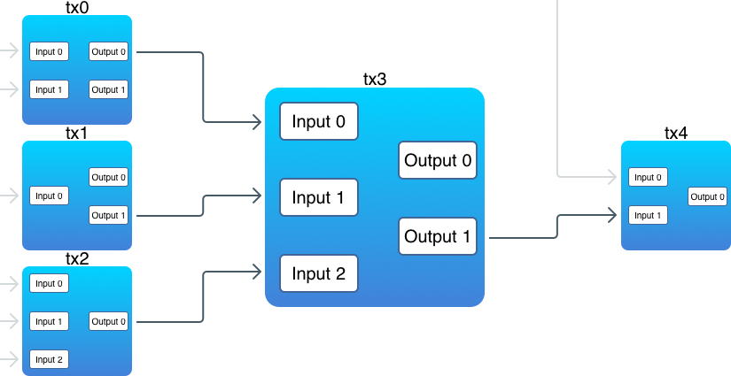

交易（1）
========

## 引言

交易（transaction）是比特币的核心所在，而区块链唯一的目的，也正是为了能够安全可靠地存储交易。在区块链中，交易一旦被创建，就没有任何人能够再去修改或是删除它。今天，我们将会开始实现交易。不过，由于交易是很大的话题，我会把它分为两部分来讲：在今天这个部分，我们会实现交易的基本框架。在第二部分，我们会继续讨论它的一些细节。

由于比特币采用的是 UTXO 模型，并非账户模型，并不直接存在“余额”这个概念，余额需要通过遍历整个交易历史得来。

## 比特币交易

点击 [这里](https://blockchain.info/zh-cn/tx/b6f6b339b546a13822192b06ccbdd817afea5311845f769702ae2912f7d94ab5) 在 blockchain.info 查看下图中的交易信息。


一笔交易由一些输入（input）和输出（output）组合而来：

```python
class Transaction(object):
    def __init__(self, vins, vouts):
        self.txid = ''
        self.vins = vins
        self.vouts = vouts
```

对于每一笔新的交易，它的输入会引用（reference）之前一笔交易的输出（这里有个例外，coinbase 交易），引用就是花费的意思。所谓引用之前的一个输出，也就是将之前的一个输出包含在另一笔交易的输入当中，就是花费之前的交易输出。交易的输出，就是币实际存储的地方。下面的图示阐释了交易之间的互相关联：



注意：

1. 有一些输出并没有被关联到某个输入上
2. 一笔交易的输入可以引用之前多笔交易的输出
3. 一个输入必须引用一个输出

贯穿本文，我们将会使用像“钱（money）”，“币（coin）”，“花费（spend）”，“发送（send）”，“账户（account）” 等等这样的词。但是在比特币中，其实并不存在这样的概念。交易仅仅是通过一个脚本（script）来锁定（lock）一些值（value），而这些值只可以被锁定它们的人解锁（unlock）。

每一笔比特币交易都会创造输出，输出都会被区块链记录下来。给某个人发送比特币，实际上意味着创造新的 UTXO 并注册到那个人的地址，可以为他所用。

## 交易输出

先从输出（output）开始：

```python
class TXOutput(object):
    def __init__(self, value, script_pub_key):
        self.value = value
        self.script_pub_key = script_pub_key
```

输出主要包含两部分：

1. 一定量的比特币(`Value`)
2. 一个锁定脚本(`script_pub_key`)，要花这笔钱，必须要解锁该脚本。

实际上，正是输出里面存储了“币”（注意，也就是上面的 `Value` 字段）。而这里的存储，指的是用一个数学难题对输出进行锁定，这个难题被存储在 `script_pub_key` 里面。在内部，比特币使用了一个叫做 *Script* 的脚本语言，用它来定义锁定和解锁输出的逻辑。虽然这个语言相当的原始（这是为了避免潜在的黑客攻击和滥用而有意为之），并不复杂，但是我们也并不会在这里讨论它的细节。你可以在[这里](https://en.bitcoin.it/wiki/Script) 找到详细解释。

>在比特币中，`value` 字段存储的是 *satoshi* 的数量，而不是 BTC 的数量。一个 *satoshi* 等于一亿分之一的 BTC(0.00000001 BTC)，这也是比特币里面最小的货币单位（就像是 1 分的硬币）。

由于还没有实现地址（address），所以目前我们会避免涉及逻辑相关的完整脚本。`script_pub_key` 将会存储一个任意的字符串（用户定义的钱包地址）。

>顺便说一下，有了一个这样的脚本语言，也意味着比特币其实也可以作为一个智能合约平台。

关于输出，非常重要的一点是：它们是**不可再分的（indivisible）**。也就是说，你无法仅引用它的其中某一部分。要么不用，如果要用，必须一次性用完。当一个新的交易中引用了某个输出，那么这个输出必须被全部花费。如果它的值比需要的值大，那么就会产生一个找零，找零会返还给发送方。这跟现实世界的场景十分类似，当你想要支付的时候，如果一个东西值 1 美元，而你给了一个 5 美元的纸币，那么你会得到一个 4 美元的找零。
## 发送币

现在，我们想要给其他人发送一些币。为此，我们需要创建一笔新的交易，将它放到一个块里，然后挖出这个块。之前我们只实现了 coinbase 交易（这是一种特殊的交易），现在我们需要一种通用的普通交易：
```python
def new_transaction(self, from_addr, to_addr, amount):
        inputs = []
        outputs = []
        acc, valid_outpus = self._find_spendable_outputs(from_addr, amount)
        if acc < amount:
            raise NotEnoughAmountError(u'not enough coin')
        for txid, outs in valid_outpus.items():
            for out in outs:
                out_index = out[0]
                input = TXInput(txid, out_index, from_addr)
                inputs.append(input)
        
        output = TXOutput(amount, to_addr)
        outputs.append(output)
        if acc > amount:
            # a change
            outputs.append(TXOutput(acc - amount, from_addr))

        tx = Transaction(inputs, outputs)
        tx.set_id()

        return tx
```


在创建新的输出前，我们首先必须找到所有的未花费输出，并且确保它们有足够的价值（value），这就是 `_find_spendable_outputs` 方法要做的事情。随后，对于每个找到的输出，会创建一个引用该输出的输入。接下来，我们创建两个输出：

1. 一个由接收者地址锁定。这是给其他地址实际转移的币。

2. 一个由发送者地址锁定。这是一个找零。只有当未花费输出超过新交易所需时产生。记住：输出是**不可再分的**。
这个方法对所有的未花费交易进行迭代，并对它的值进行累加。当累加值大于或等于我们想要传送的值时，它就会停止并返回累加值，同时返回的还有通过交易 ID 进行分组的输出索引。我们只需取出足够支付的钱就够了。
现在我们修改`add_block`方法:
```python
    def add_block(self, transactions):
        """
        add a block to block_chain
        """
        last_block = self.get_last_block()
        prev_hash = last_block.get_header_hash()
        height = last_block.block_header.height + 1
        block_header = BlockHeader('', height, prev_hash)
        block = Block(block_header, transactions)
        block.mine()
        block.set_header_hash()
        self.db.create(block.block_header.hash, block.serialize())
        last_hash = block.block_header.hash
        self.set_last_hash(last_hash)
```
最后，让我们来实现 `send` 方法：

```python
def send(bc, from_addr, to_addr, amount):
    bc = BlockChain()
    tx = bc.new_transaction(from_addr, to_addr, amount)
    bc.add_block([tx])
    print('send %d from %s to %s' %(amount, from_addr, to_addr))
```
发送币意味着创建新的交易，并通过挖出新块的方式将交易打包到区块链中。不过，比特币并不是一连串立刻完成这些事情（虽然我们目前的实现是这么做的）。相反，它会将所有新的交易放到一个内存池中（mempool），然后当矿工准备挖出一个新块时，它就从内存池中取出所有交易，创建一个候选块。只有当包含这些交易的块被挖出来，并添加到区块链以后，里面的交易才开始确认。

让我们来检查一下发送币是否能工作：
首先我们要执行main.py完成创世块的构建
```bash
$ python3 main.py
Mining a new block
Found nonce == 17ash_hex == 01ded3ff2872093f2eefcd7b8b5b264e96996f31f933e6636db034b4151b61aa
Block(_block_header=BlockHeader(timestamp='1551086196.4749706', hash_merkle_root='', prev_block_hash='', hash='ce93f6e1a2f7dec3a538e8b6397e4b8eba59bace2e7ac08f82875447d2660173', nonce=None, height=0))
Block(_block_header=BlockHeader(timestamp='1551086196.6248493', hash_merkle_root='', prev_block_hash='', hash='d5ecad2ed10a978e2f280e62d6a25ce4def6cdfc66ac9dcd124c24c5a4b9ac07', nonce=17, height=1))
```
```bash
$ python3 cli.py send --from zhangsanaddr --to lisiaddr --amount 10
Found nonce == 0ash_hex == 08c67066d0c7fc8d2ef80076e91626ff05999046ae0248e1971b99a30541518b
send 10 from zhangsanaddr to lisiaddr
```
## 余额查看
```python
def get_balance(bc, addr):
    balance = 0
    utxos = bc.find_UTXO(addr)
    for utxo in utxos:
        balance += utxo.value
    print('%s balance is %d' %(addr, balance))
```
`find_UTXO`方法找出所有的UTXO,实现如下:
```python
def find_UTXO(self, address):
        utxos = []
        unspent_txs = self._find_unspent_transactions(address)
        for _, vouts in unspent_txs.items():
            for vout in vouts:
                if vout.can_unlock_output_with(address):
                    utxos.append(vout)
        return utxos
```
先利用`_find_unspent_transactions`找出所有的未花费交易，并判断是否是当前地址可以解锁的，就找出了所有的UTXO。

测试一下效果:
```bash
$ python3 cli.py balance zhangsanaddr 
zhangsanaddr balance is 980
```
## 总结

虽然不容易，但是现在终于实现交易了！不过，我们依然缺少了一些像比特币那样的一些关键特性：

1. 地址（address）。我们还没有基于私钥（private key）的真实地址。

2. 奖励（reward）。现在挖矿是肯定无法盈利的！

3. UTXO 集。获取余额需要扫描整个区块链，而当区块非常多的时候，这么做就会花费很长时间。并且，如果我们想要验证后续交易，也需要花费很长时间。而 UTXO 集就是为了解决这些问题，加快交易相关的操作。

4. 内存池（mempool）。在交易被打包到块之前，这些交易被存储在内存池里面。在我们目前的实现中，一个块仅仅包含一笔交易，这是相当低效的。


参考：
[1] [transactions](https://github.com/liuchengxu/blockchain-tutorial/blob/master/content/part-4/transactions-1.md)
[2] [本节完整实现源码](https://github.com/xiaobing94/pysimpleblockchain/tree/part4)