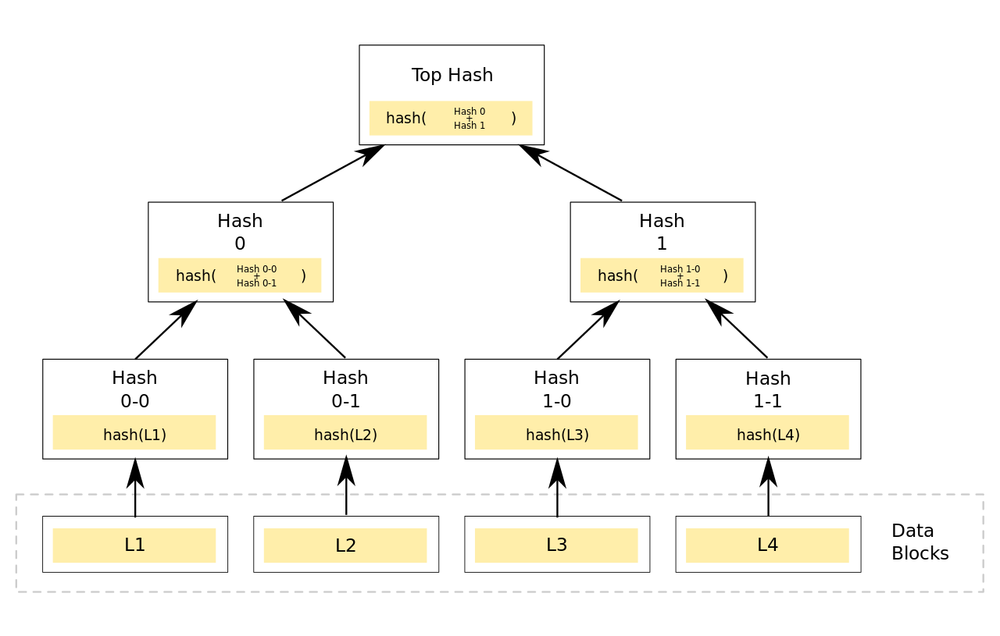

交易（2）
========

## 引言

在这个系列文章的一开始，我们就提到了，区块链是一个分布式数据库。不过在之前的文章中，我们选择性地跳过了“分布式”这个部分，而是将注意力都放到了“数据库”部分。到目前为止，我们几乎已经实现了一个区块链数据库的所有元素。今天，我们将会分析之前跳过的一些机制。而在下一篇文章中，我们将会开始讨论区块链的分布式特性。

## 奖励

在上一篇文章中，我们略过的一个小细节是挖矿奖励。现在，我们已经可以来完善这个细节了。

挖矿奖励，实际上就是一笔 coinbase 交易。当一个挖矿节点开始挖出一个新块时，它会将交易从队列中取出，并在前面附加一笔 coinbase 交易。coinbase 交易只有一个输出，里面包含了矿工的公钥哈希。

实现奖励，非常简单，更新 `send` 即可：

```python
def add_block(self, transactions):
    """
    add a block to block_chain
    """
    last_block = self.get_last_block()
    prev_hash = last_block.get_header_hash()
    height = last_block.block_header.height + 1
    block_header = BlockHeader('', height, prev_hash)
    
    # reward to wallets[0]
    wallets = Wallets()
    keys = list(wallets.wallets.keys())
    w = wallets[keys[0]]
    coin_base_tx = self.coin_base_tx(w.address)
    transactions.insert(0, coin_base_tx)
    block = Block(block_header, transactions)
    block.mine(self)
    block.set_header_hash()
    self.db.create(block.block_header.hash, block.serialize())
    last_hash = block.block_header.hash
    self.set_last_hash(last_hash)

    utxo = UTXOSet()
    utxo.update(block)
```
奖励给当前钱包的第一个地址。
## UTXO 集

在 Part 3: 持久化和命令行接口 中，我们研究了 Bitcoin Core 是如何在一个数据库中存储块的，并且了解到区块被存储在 `blocks` 数据库，交易输出被存储在 `chainstate` 数据库。会回顾一下 `chainstate` 的机构：

1. `c` + 32 字节的交易哈希 -> 该笔交易的未花费交易输出记录
2. `B` + 32 字节的块哈希 -> 未花费交易输出的块哈希

在之前那篇文章中，虽然我们已经实现了交易，但是并没有使用 `chainstate` 来存储交易的输出。所以，接下来我们继续完成这部分。

`chainstate` 不存储交易。它所存储的是 UTXO 集，也就是未花费交易输出的集合。除此以外，它还存储了“数据库表示的未花费交易输出的块哈希”，不过我们会暂时略过块哈希这一点，因为我们还没有用到块高度（但是我们会在接下来的文章中继续改进）。

那么，我们为什么需要 UTXO 集呢？

来思考一下我们早先实现的 `Blockchain._find_unspent_transactions` 方法：

```python
def _find_unspent_transactions(self, address):
    """
    Find all unspent transactions
    """
    spent_txos = {}
    unspent_txs = {}
    
    last_block = self.get_last_block()
    last_height = last_block.block_header.height
    # Reverse
    for height in range(last_height, -1, -1):
        block = self.get_block_by_height(height)
        for tx in block.transactions:
            txid = tx.txid
            # all outputs
            for vout_index, vout in enumerate(tx.vouts):
                txos = spent_txos.get(txid, [])
                # vout_index is spent
                if vout_index in txos:
                    continue
                if vout.can_unlock_output_with(address):
                    old_vouts = unspent_txs.get(tx, [])
                    old_vouts.append(vout)
                    unspent_txs[tx] = old_vouts
            if not tx.is_coinbase():
                for vin in tx.vins:
                    if vin.can_be_unlocked_with(address):
                        txid_vouts = spent_txos.get(txid, [])
                        txid_vouts.append(vin.vout)
                        spent_txos[vin.txid] = txid_vouts
    return unspent_txs
```

这个函数找到有未花费输出的交易。由于交易被保存在区块中，所以它会对区块链里面的每一个区块进行迭代，检查里面的每一笔交易。截止 2017 年 9 月 18 日，在比特币中已经有 485，860 个块，整个数据库所需磁盘空间超过 140 Gb。这意味着一个人如果想要验证交易，必须要运行一个全节点。此外，验证交易将会需要在许多块上进行迭代。
整个问题的解决方案是有一个仅有未花费输出的索引，这就是 UTXO 集要做的事情：这是一个从所有区块链交易中构建（对区块进行迭代，但是只须做一次）而来的缓存，然后用它来计算余额和验证新的交易。截止 2017 年 9 月，UTXO 集大概有 2.7 Gb。

好了，让我们来想一下实现 UTXO 集的话需要作出哪些改变。目前，找到交易用到了以下一些方法：

1. `Blockchain._find_unspent_transactions` - 找到有未花费输出交易的主要函数。也是在这个函数里面会对所有区块进行迭代。

2. `Blockchain._find_spendable_outputs` - 这个函数用于当一个新的交易创建的时候。如果找到有所需数量的输出。使用 `Blockchain._find_unspent_transactions`.

3. `Blockchain.find_UTXO` - 找到一个公钥哈希的未花费输出，然后用来获取余额。使用 `Blockchain._find_unspent_transactions`.

4. `Blockchain.FindTransation` - 根据 ID 在区块链中找到一笔交易。它会在所有块上进行迭代直到找到它。

可以看到，所有方法都对数据库中的所有块进行迭代。但是目前我们还没有改进所有方法，因为 UTXO 集没法存储所有交易，只会存储那些有未花费输出的交易。因此，它无法用于 `Blockchain.FindTransaction`。

所以，我们想要以下方法：

1. `Blockchain.find_UTXO` - 通过对区块进行迭代找到所有未花费输出。

2. `UTXOSet.reindex` - 使用 `UTXO` 找到未花费输出，然后在数据库中进行存储。这里就是缓存的地方。

3. `UTXOSet._find_spendable_outputs` - 类似 `Blockchain._find_spendable_outputs`，但是使用 UTXO 集。

4. `UTXOSet.find_UTXO` - 类似 `Blockchain.find_UTXO`，但是使用 UTXO 集。

5. `Blockchain.find_transaction` 跟之前一样。

因此，从现在开始，两个最常用的函数将会使用 cache！来开始写代码吧。
```python
class UTXOSet(Singleton):
    FLAG = 'UTXO'
    def __init__(self, db_url='http://127.0.0.1:5984'):
        self.db = DB(db_url)
```
这里使用一个FLAG来区分普通区块和UTXO。
```python
def reindex(self, bc):
    key = self.FLAG + "l"
    last_block = bc.get_last_block()
    if key not in self.db:
        utxos = bc.find_UTXO()
        for txid, index_vouts in utxos.items():
            key = self.FLAG + txid
            # outs = []
            for index_vout in index_vouts:
                vout = index_vout[1]
                index = index_vout[0]
                
                vout_dict = vout.serialize()
                vout_dict.update({"index": index})
                tmp_key = key + "-"+str(index)
                try:
                    self.db.create(tmp_key, vout_dict)
                except ResourceConflict as e:
                    print(e)
        if not last_block:
            return
        self.set_last_height(last_block.block_header.height)
    else:
        utxo_last_height = self.get_last_height()
        last_block_height = last_block.block_header.height
        for i in range(utxo_last_height, last_block_height):
            block = bc.get_block_by_height(i)
            self.update(block)
```
这个方法首先判断是否已经构建过UTXO集，如果没有构建过就从头开始构建UTXO集，如果已经构建过了，就把当前UTXO的区块至最新的区块进行更新。
`Blockchain.FindUTXO` 几乎跟 `Blockchain.FindUnspentTransactions` 一模一样，但是现在它返回了一个 `TransactionID -> TransactionOutputs` 的 map。

现在，UTXO 集可以用于发送币：

```python
def find_spendable_outputs(self, address, amount):
    utxos = self.find_utxo(address)
    accumulated = 0
    spendable_utxos = []
    for ftxo in utxos:
        output = ftxo.txoutput
        accumulated += output.value
        spendable_utxos.append(ftxo)
        if accumulated >= amount:
            break
    return accumulated, spendable_utxos
```
或者检查余额：
```python
def find_utxo(self, address):
    query = {
        "selector": {
            "_id": {
                "$regex": "^UTXO"
            },
            "pub_key_hash": address
        }
    }
    docs = self.db.find(query)
    utxos = []
    for doc in docs:
        index = doc.get("index", None)
        if index is None:
            continue
        doc_id = doc.id
        txid_index_str = doc_id.replace(self.FLAG, "")
        _flag_index = txid_index_str.find("-")
        txid = txid_index_str[:_flag_index]
        ftxo = FullTXOutput(txid, TXOutput.deserialize(doc), index)
        utxos.append(ftxo)
    return utxos
```
有了 UTXO 集，也就意味着我们的数据（交易）现在已经被分开存储：实际交易被存储在区块链中，未花费输出被存储在 UTXO 集中。这样一来，我们就需要一个良好的同步机制，因为我们想要 UTXO 集时刻处于最新状态，并且存储最新交易的输出。但是我们不想每生成一个新块，就重新生成索引，因为这正是我们要极力避免的频繁区块链扫描。因此，我们需要一个机制来更新 UTXO 集：

```python
def update(self, block):
    for tx in block.transactions:
        txid = tx.txid
        key = self.FLAG + txid
        # add uxto
        for vout_index, vout in enumerate(tx.vouts):
            vout_dict = vout.serialize()
            vout_dict.update({"index": vout_index})
            tmp_key = key + "-" +str(vout_index)
            try:
                self.db.create(tmp_key, vout_dict)
            except ResourceConflict as e:
                print(e)
        # vins delete used utxo
        for vin in tx.vins:
            vin_txid = vin.txid
            key = self.FLAG + vin_txid + "-" +str(vin.vout)
            doc = self.db.get(key)
            if not doc:
                continue
            try:
                self.db.delete(doc)
            except ResourceNotFound as e:
                print(e)
    self.set_last_height(block.block_header.height)

```

虽然这个方法看起来有点复杂，但是它所要做的事情非常直观。当挖出一个新块时，应该更新 UTXO 集。更新意味着移除已花费输出，并从新挖出来的交易中加入未花费输出。如果一笔交易的输出被移除，并且不再包含任何输出，那么这笔交易也应该被移除。相当简单！
```bash
# 创建创世块
$python3 main.py
<wallet.Wallet object at 0x0000010AED8276A0> <wallet.Wallet object at 0x0000010AED827940>
19RUj6zvbrAXNnEtkuric5pYQJTkZy57nc 17AEyyKbeoEbfMa3jS8Uji6tVG37DrTJN9
Mining a new block
Found nonce == 53ash_hex == 0adfd71d90955ad9219871d8abe03ae83ef9f1f13f9a141ef6ca0ce2d16c93af
('conflict', 'Document update conflict.')
Block(_block_header=BlockHeader(timestamp='1551246051.6814992', hash_merkle_root='1f6cf2e68e8ab0dda1cc1550f85b4df85b83db3cc3af262b26a5a306121725be', prev_block_hash='', hash='ef20a87f2edc8589e813be60d534e736f51c45a3ec94e1918c18bce057afc89d', nonce=None, height=0))
Block(_block_header=BlockHeader(timestamp='1551246052.0582814', hash_merkle_root='3cf2c8514fdaac0cb2b6502f72cf267bcf9966042be28ee48eff61e4695a90f2', prev_block_hash='ef20a87f2edc8589e813be60d534e736f51c45a3ec94e1918c18bce057afc89d', hash='b0bdedf26575722a7efdf94db7dfa60c1c4dfe1483529ff04dd553d6828de718', nonce=53, height=1))

# 转账
$python3 cli.py send --from 19RUj6zvbrAXNnEtkuric5pYQJTkZy57nc --to 17AEyyKbeoEbfMa3jS8Uji6tVG37DrTJN9 --amount 10
Mining a new block
Found nonce == 20ash_hex == 07e91245d4e66b66279224980b0325c37d2f2e54a75402bdcd8fe55346cb3dcb
send 10 from 19RUj6zvbrAXNnEtkuric5pYQJTkZy57nc to 17AEyyKbeoEbfMa3jS8Uji6tVG37DrTJN9

# 查询余额
$python3 cli.py balance 19RUj6zvbrAXNnEtkuric5pYQJTkZy57nc
19RUj6zvbrAXNnEtkuric5pYQJTkZy57nc balance is 1980
```

一切工作正常， `19RUj6zvbrAXNnEtkuric5pYQJTkZy57nc`收到了创世块和转账的奖励2000个，转账了两次一共使用了20个，剩余1980个。

## Merkle 树

在这篇文章中，我还想要再讨论一个优化机制。

上如上面所提到的，完整的比特币数据库（也就是区块链）需要超过 140 Gb 的磁盘空间。因为比特币的去中心化特性，网络中的每个节点必须是独立，自给自足的，也就是每个节点必须存储一个区块链的完整副本。随着越来越多的人使用比特币，这条规则变得越来越难以遵守：因为不太可能每个人都去运行一个全节点。并且，由于节点是网络中的完全参与者，它们负有相关责任：节点必须验证交易和区块。另外，要想与其他节点交互和下载新块，也有一定的网络流量需求。

在中本聪的 [比特币原始论文](https://bitcoin.org/bitcoin.pdf) 中，对这个问题也有一个解决方案：简易支付验证（Simplified Payment Verification, SPV）。SPV 是一个比特币轻节点，它不需要下载整个区块链，也**不需要验证区块和交易**。相反，它会在区块链查找交易（为了验证支付），并且需要连接到一个全节点来检索必要的数据。这个机制允许在仅运行一个全节点的情况下有多个轻钱包。

为了实现 SPV，需要有一个方式来检查是否一个区块包含了某笔交易，而无须下载整个区块。这就是 Merkle 树所要完成的事情。

比特币用 Merkle 树来获取交易哈希，哈希被保存在区块头中，并会用于工作量证明系统。到目前为止，我们只是将一个块里面的每笔交易哈希连接了起来，将在上面应用了 SHA-256 算法。虽然这是一个用于获取区块交易唯一表示的一个不错的途径，但是它没有利用到 Merkle 树。

来看一下 Merkle 树：



每个块都会有一个 Merkle 树，它从叶子节点（树的底部）开始，一个叶子节点就是一个交易哈希（比特币使用双 SHA256 哈希）。叶子节点的数量如果不是双数，就只取单个数据的hash。

从下往上，两两成对，连接两个节点哈希，将组合哈希作为新的哈希。新的哈希就成为新的树节点。重复该过程，直到仅有一个节点，也就是树根。根哈希然后就会当做是整个块交易的唯一标示，将它保存到区块头，然后用于工作量证明。

Merkle 树的好处就是一个节点可以在不下载整个块的情况下，验证是否包含某笔交易。并且这些只需要一个交易哈希，一个 Merkle 树根哈希和一个 Merkle 路径。

>这部分的描述和https://github.com/liuchengxu/blockchain-tutorial/blob/master/content/part-6/transactions-2.md描述有所不同，因为存在叶子节点为双数，但是第二层为单数的情况，会导致原版代码出现索引越界的情况。这部分的描述参考https://www.cnblogs.com/fengzhiwu/p/5524324.html

实现代码如下：
```python
class MerkleNode(object):
    def __init__(self, left_node, right_node, data):
        self.left = left_node
        self.right = right_node
        if not self.left and not self.right:
            self.data = sum256_hex(data)
        else:
            data = self.left.data + self.right.data
            self.data = sum256_hex(data)

class MerkleTree(object):
    def __init__(self, datas):
        nodes = []

        for data_item in datas:
            node = MerkleNode(None, None, data_item)
            nodes.append(node)

        for _ in range(len(datas)//2):
            new_level = []
            for j in range(0, len(nodes), 2):
                if j + 1 >= len(nodes):
                    node = MerkleNode(nodes[j], "", None)
                else:
                    node = MerkleNode(nodes[j], nodes[j+1], None)
                new_level.append(node)
            nodes = new_level
        self.root_node = nodes[0]

    @property
    def root_hash(self):
        return self.root_node.data
```
如果最后只有单个节点，那么就将另一个数据置空，只计算一个数据的哈希。
```python
if j + 1 >= len(nodes):
    node = MerkleNode(nodes[j], "", None)
```
根节点的data域就是哈希。
```python
@property
def root_hash(self):
    return self.root_node.data
```

## P2PKH

还有一件事情，我想要再谈一谈。

大家应该还记得，在比特币中有一个 *脚本（Script）*编程语言，它用于锁定交易输出；交易输入提供了解锁输出的数据。这个语言非常简单，用这个语言写的代码其实就是一系列数据和操作符而已。比如如下示例：

```
5 2 OP_ADD 7 OP_EQUAL
```

5, 2, 和 7 是数据，`OP_ADD` 和 `OP_EQUAL` 是操作符。*脚本*代码从左到右执行：将数据依次放入栈内，当遇到操作符时，就从栈内取出数据，并将操作符作用于数据，然后将结果作为栈顶元素。*脚本*的栈，实际上就是一个先进后出的内存存储：栈里的第一个元素最后一个取出，后面的每一个元素都会放到前一个元素之上。

让我们来对上面的脚本分部执行：

步骤   | 栈     | 脚本                    | 说明
:----: | :----  | :----                   | :----
1      | 空     | `5 2 OP_ADD 7 OP_EQUAL` | 一开始栈为空
2      | `5`    | `2 OP_ADD 7 OP_EQUAL`   | 从脚本里面取出 `5` 放入栈上
3      | `5 2`  | `OP_ADD 7 OP_EQUAL`     | 从脚本里面取出 `2` 放入栈上
4      | `7`    | `7 OP_EQUAL`            | 遇到操作符 `OP_ADD`, 从栈里取出两个操作数 `5` 和 `2`，相加后将结果放回栈上
5      | `7 7`  | `OP_EQUAL`              | 从脚本里面取出 `7` 放到栈上
6      | `true` | 空                      | 遇到操作符 `OP_EQUAL`，从栈里取出两个操作数并比较，将比较的结果放回栈内，脚本执行完毕，为空

`OP_ADD` 从栈内取两个元素，将这两个元素进行相加，然后将结果重新放回栈内。`OP_EQUAL` 从栈内取两个元素，然后对这两个元素进行比较：如果它们相等，就在栈上放一个 `true`，否则放一个 `false`。脚本执行的结果就是栈顶元素：在我们的案例中，如果是 `true`，那么表明脚本执行成功。

现在来看一下在比特币中，是如何用脚本执行支付的：

```
<signature> <pubKey> OP_DUP OP_HASH160 <pubKeyHash> OP_EQUALVERIFY OP_CHECKSIG
```

这个脚本叫做 *Pay to Public Key Hash(P2PKH)*，这是比特币最常用的一个脚本。它所做的事情就是向一个公钥哈希支付，也就是说，用某一个公钥锁定一些币。这是**比特币支付的核心**：没有账户，没有资金转移；只有一个脚本检查提供的签名和公钥是否正确。

这个脚本实际存储为两个部分：

1. 第一个部分，`<signature> <pubkey>`，存储在输入的 `ScriptSig` 字段。

2. 第二部分，`OP_DUP OP_HASH160 <pubkeyHash> OP_EQUALVERYFY OP_CHECKSIG` 存储在输出的 `ScriptPubKey` 里面。

因此，输出定了解锁的逻辑，输入提供解锁输出的“钥匙”。然我们来执行一下这个脚本：

步骤   | 栈                                               | 脚本
:----: | :----                                            | :----
1      | 空                                               | `<signature> <pubKey> OP_DUP OP_HASH160 <pubKeyHash> OP_EQUALVERIFY OP_CHECKSIG`
2      | `<signature>`                                    | `<pubKey> OP_DUP OP_HASH160 <pubKeyHash> OP_EQUALVERIFY OP_CHECKSIG`
3      | `<signature> <pubkey>`                           | `OP_DUP OP_HASH160 <pubKeyHash> OP_EQUALVERIFY OP_CHECKSIG`
4      | `<signature> <pubKey> <pubKey>`                  | `OP_HASH160 <pubKeyHash> OP_EQUALVERIFY OP_CHECKSIG`
5      | `<signature> <pubKey> <pubKeyHash>`              | `<pubKeyHash> OP_EQUALVERIFY OP_CHECKSIG`
6      | `<signature> <pubKey> <pubKeyHash> <pubKeyHash>` | `OP_EQUALVERIFY OP_CHECKSIG`
7      | `<signature> <pubKey>`                           | `OP_CHECKSIG`
8      | `true` 或 `false`                                | 空

`OP_DUP` 对栈顶元素进行复制。`OP_HASH160` 取栈顶元素，然后用 `RIPEMD160` 对它进行哈希，再将结果送回到栈上。`OP_EQUALVERIFY` 将栈顶的两个元素进行比较，如果它们不相等，终止脚本。`OP_CHECKSIG` 通过对交易进行哈希，并使用 `<signature>` 和 `pubKey` 来验证一笔交易的签名。最后的操作符有点复杂：它生成了一个修剪后的交易副本，对它进行哈希（因为它是一个被签名后的交易哈希），然后使用提供的 `<signature>` 和 `pubKey` 检查签名是否正确。

有了一个这样的脚本语言，实际上也可以让比特币成为一个智能合约平台：除了将一个单一的公钥转移资金，这个语言还使得一些其他的支付方案成为可能。

## 总结

这就是今天的全部内容了！我们已经实现了一个基于区块链的加密货币的几乎所有关键特性。我们已经有了区块链，地址，挖矿和交易。我们还缺少网络让所有的节点联合起来。

参考：
[1] [transactions2](https://github.com/liuchengxu/blockchain-tutorial/blob/master/content/part-6/transactions-2.md)
[2] [本节完整实现源码](https://github.com/xiaobing94/pysimpleblockchain/tree/part6)